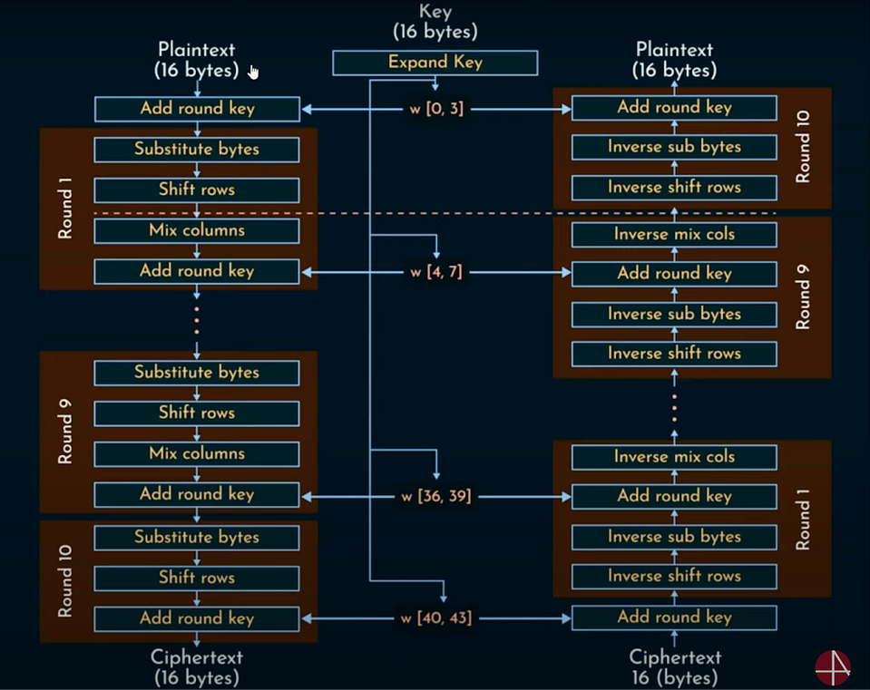
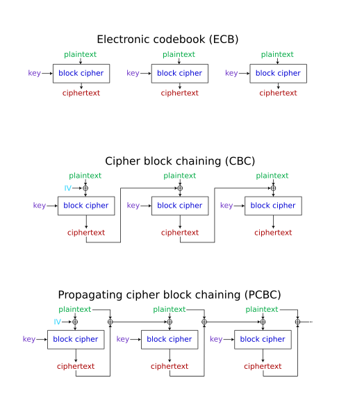

# AES Encryption & Decryption Utility

This is a command-line utility for performing AES (Advanced Encryption Standard) encryption and decryption. The program supports key sizes of 128, 192, and 256 bits, and allows users to input messages manually or from a text file.

## Author
- **Anurag Mishra (anuragmishra-creates)**

## Features
- **AES-128, AES-192, and AES-256 Support**: Choose between three standard cipher key sizes.
- **Modes of Operation**: Supports commonly used block cipher modes:
  - **ECB (Electronic Codebook)**: Each block is encrypted independently.
  - **CBC (Cipher Block Chaining)**: Each block is XORed with the previous ciphertext block before encryption.
  - **PCBC (Propagating Cipher Block Chaining)**: Similar to CBC but any change in plaintext or ciphertext affects all subsequent blocks.
- **Key Management**: Easily change the cipher key, which is automatically padded or truncated to the correct length.
- **Flexible Input**: Enter your message directly or read it from a `.txt` file.
- **Debug Mode:** A toggleable debug mode provides detailed output of the encryption and decryption processes, showing the state of the blocks before and after each step.
- **Colorful CLI:** The command-line interface features colorful menus and highlights for easy navigation and spotting of options.


## Diagrams:



## Project Structure
```text
├── include/
│   ├── AESConstants.h
│   ├── AESDecryption.h
│   ├── AESEncryption.h
│   ├── AESGlobals.h
│   ├── AESHelpers.h
│   └── AESKeySchedule.h
├── media/
|   ├── Steps.png
│   └── ModesOfOperations.png
├── src/
│   ├── AESConstants.c
│   ├── AESDecryption.c
│   ├── AESEncryption.c
│   ├── AESGlobals.c
│   ├── AESHelpers.c
│   ├── AESKeySchedule.c
│   └── main.c
├── Makefile
└── README.md

```

## How to Compile and Run
This project uses a **Makefile** to automate the compilation process.

**1. Compile the program:**
Open your terminal in the project's root directory and run the `make` command. This will compile all source files and link them into a single executable.

```bash
make
```

**2. Run the program:**
After compilation, you can execute the AES utility with:

```bash
./AESUtility
```

**3. Clean the build:**
To remove the compiled executable and start fresh, run:

```bash
make clean
```

## Future Features

- **GUI (Graphical User Interface):** User-friendly interface with drag-and-drop support and progress indicators.  
- **Audio, Video & Other File Support:** Encrypt/decrypt files like `.mp3`, `.mp4`, `.jpg`, `.pdf` while preserving format.  
- **Directory Encryption/Decryption:** Encrypt/decrypt entire folders, preserving structure; supports batch processing.  
- **More Modes of Operation:** Supports additional AES modes: CFB, OFB, CTR for flexible encryption options.  
